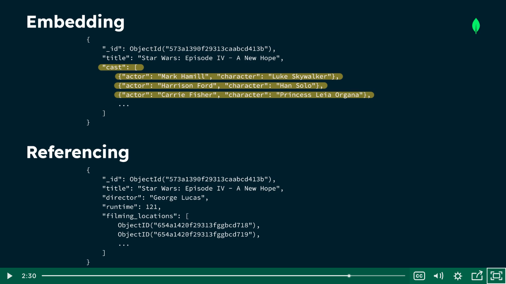

## Types of relationships

Data that is accessed together shoud be stored together.

1. one to one
2. one to many
3. many to many

### One to one

We can have one to one relationship in theh single document.

i.e single movie has single director.

```json
{
    "_id": ObjectId("00000001"),
    "name": "Marnie Dupree",
    "grade": "Freshman",
    "studentId": 123456,
    "email": "mdupree@college.edu"
}
```

### One to Many

A relationship where a data entity in one set is connected to any number of data entities in another set.

In movie under cast there are many actors.

### Many to Many 

A relationship where any number of data entities in one set are connected to any number of data entities in another set.

#### Embedding
We take related data and insert it into our document

#### Referencing 
We refer to documents in another collection in our document

