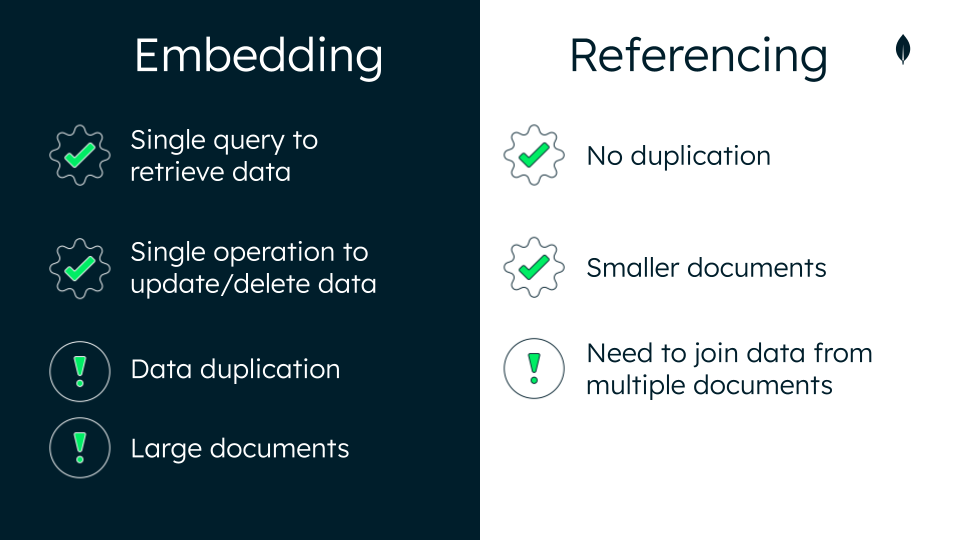

## References

When you are using 2 or more collections to store data and want to ensure that those collections are related we use references.

It save the _id field of one document in another document as a link between the two.

They are simple and sufficient for most use cases.
Using references is called linking or data normalisation

### advantages
- No duplication of data
- Smaller documents

### disadvantages
- Querying from multiple documents costs extra resources and impacts read performance.



<details> <summary>Example</summary>


```json
...
{
    "id": "AL001",
    "name": "Ella Richardson"
},
{
    "id": "AL002",
    "name": "Jackie Thomas"
},
{
    "id": "AL003",
    "name": "Justin McDonald"
},
... 
```

```json
{
    "author": "Aileen Long",
    "title": "Learn MongoDB in 30 Mins",
    "published_date": ISODate("2020-05-18T14:10:30Z"),
    "tags": ["mongodb", "introductory", "database", "nosql"],
    "comments": [
        {
            "comment_id": "LM001",
            "user_id": "AL001",
            "comment_date": ISODate("2020-05-19T14:22:00Z"),
            "comment": "Great read!"
        },
        {
            "comment_id": "LM002",
            "user_id": "AL002",
            "comment_date": ISODate("2020-06-01T08:00:00Z"),
            "comment": "So easy to understand - thanks!"
        }
    ]
}
```

</Details> <br>

Here, `user_id` is a reference to a document in the users collection