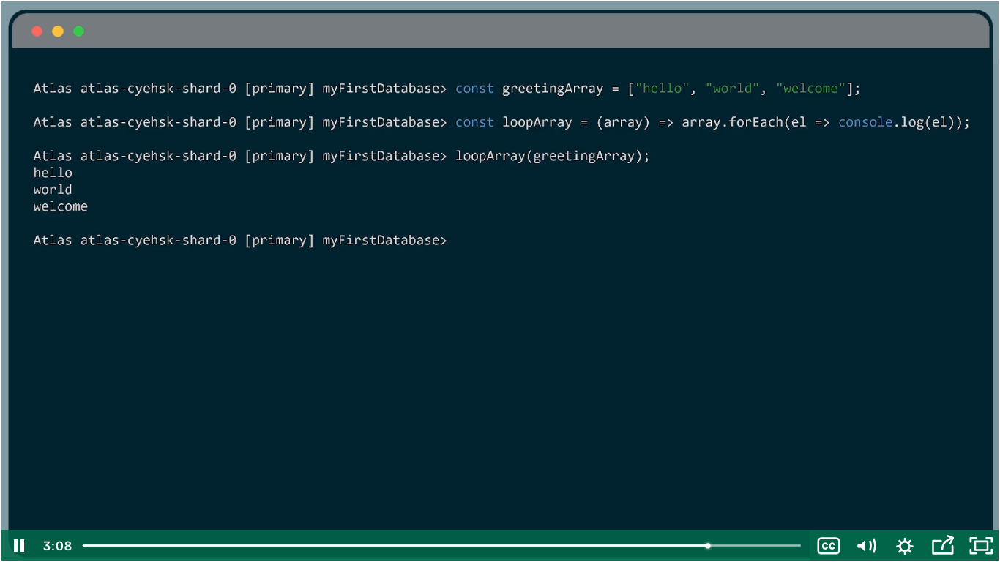

## Connecting to a MongoDB Atlas Cluster with the Shell

Login to atlas
go to database
click on connect
select first option `shell`
Install shell if not.
And click on *I have shell* you will see the connection string for MongoDB shell

Which REPL environment does the MongoDB Shell use? Node.

