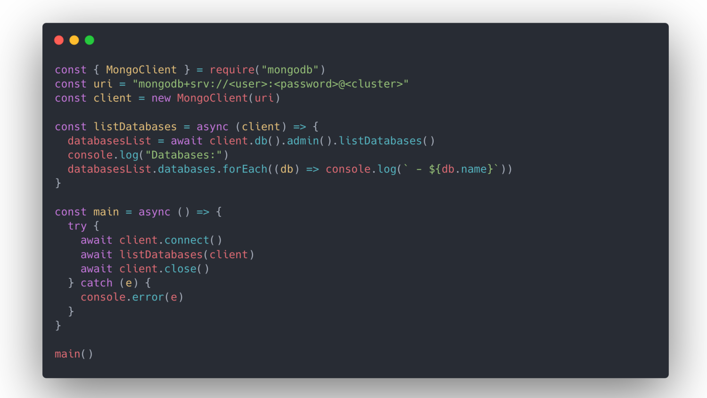

An application should use a single MongoClient instance for all database requests.
Creating MongoClients is resource intensive.

Creating a new MongoClient for each request will affect the application's performance.

---

Use the npm package manager to install the MongoDB Node.js Driver.

We need a valid connection string to connect to our database via the driver

The connection string is available in the Atlas dashboard

---

Steps

```bash
mkdir test
cd test
npm init -y
# code .
npm install MongoDB
touch atlas_uri.js
touch app.js
```
